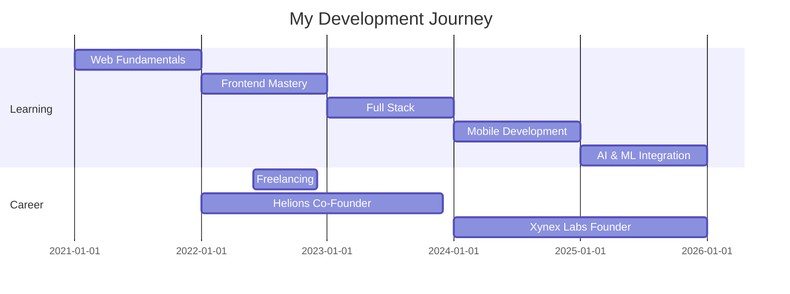

<!-- Animated Header -->

<!-- Typing Animation -->

 

<!-- Animated Badges -->

---

### 🚀 About Me

I’m Dinidu Galahitiyawa, a Full Stack & Mobile App Developer from Sri Lanka 🇱🇰 with 3 years of experience building scalable web and mobile applications. Founder of Xynex Labs, I’ve delivered 50+ projects for 30+ clients.

I specialize in React, Next.js, Node.js, React Native, Flutter, and cloud platforms like AWS, Docker, and Vercel, with a strong focus on AI/ML integration and scalable system design. I enjoy learning advanced technologies and building AI-powered, production-ready solutions 🚀.
---

### 🛠️ Tech Arsenal

#### 💻 Frontend Development

#### 📱 Mobile Development

#### ⚙️ Backend & APIs

#### 🤖 AI & Machine Learning

#### 🗄️ Databases

#### ☁️ Cloud & DevOps

---

### 📊 GitHub Activity

**20+ Projects Completed** • **3+ Years Experience** • **10+ Happy Clients**

---

### 💼 Professional Timeline

---

### 📫 Let's Connect

---

---

### 👀 Profile Views

---

**💼 Open for Work** | **🚀 Building the Future** | **🤝 Let's Collaborate**

